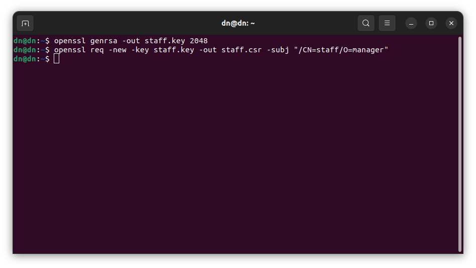

# Никоноров Денис - FOPS-8
# Домашнее задание к занятию «Управление доступом»

------

### Задание 1.Создайте конфигурацию для подключения пользователя
1. Создайте и подпишите SSL-сертификат для подключения к кластеру.
2. Настройте конфигурационный файл kubectl для подключения.
3. Создайте роли и все необходимые настройки для пользователя.
4. Предусмотрите права пользователя. Пользователь может просматривать логи подов и их конфигурацию (`kubectl logs pod <pod_id>`, `kubectl describe pod <pod_id>`).
5. Предоставьте манифесты и скриншоты и/или вывод необходимых команд.

------

### Решение задания 1.Создайте конфигурацию для подключения пользователя

Использую OpenSSL создал файл ключа.
И создан запрос на подписание сертификата (CSR)

Генерация файла сертивиката (CRT). Используя ключи кластера положить их по пути `/var/snap/microk8s/current/certs/`:

Настройка конфигурационого файла kubectl для подключения

Создан пользователь `staff` и настраиваю его на использование созданого ключа выше.

Создан новый контекст с именем `staff-context` и подключен к пользователю `staff`.

Проверка контекста

Он создался.

Создание отдельного namespace:

Включаю встроеный в Microk8s RBAC контроллера.

Написан манифест [role](/role.yml) который создаст (Role) и манифест [rolebinfing](/rolebinding.yml) привязывает роль к namespace.

Что бы проверить права пользователя надо перелючится в его контекст.

Разворачиваю [deployment](/deployment.yml) в разрешенном для пользователя Namespace:

Теперь проверим какие развернуты поды в namespace с именем `default`:

Видно что в namespace с именем `default` нет доступа из-за того что он не был указан в манифесте Role.

Но проверив поды в namespace `access-control`, то список подов будет выведен.

Проверка логов пода

Проверка describe пода

Манифест роли и ее привязка к namespace, у пользователя `stuff` есть доступ к подам, логам и описанию